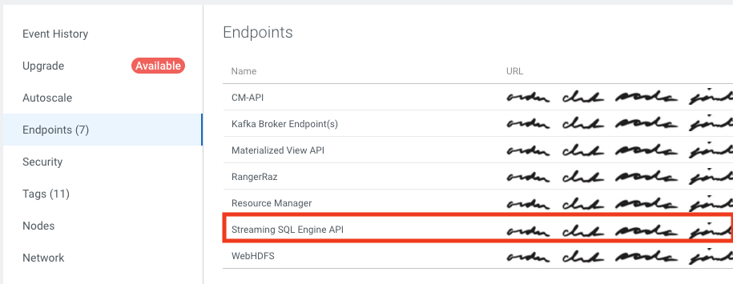

= SQL Stream Builder API examples

The intent of this repository is to provide examples on how to use link:https://docs.cloudera.com/cdf-datahub/latest/how-to-ssb/topics/csa-ssb-using-rest-api.html[]SQL Stream Builder REST API].
Rather than disjoint set of code snippets the example come in the form of a Python CLI script that uses the API to perform SSB operations.
Feel free to browse the code and see how it's done.

If you is curious about other examples, please add an issue to this repository with your requests and I'll add more examples over time.

== Usage
[source,bash]
----
Usage: ssb-tools [-h] [-c CONFIG] [-b BASE_URL] [-u USERNAME] [-p PASSWORD] [--debug] {list-projects,list-jobs,list-jobs-state,update-jobs,stop-jobs,start-jobs} ...

Commands:
    list-projects       List SSB projects.
    list-jobs           List SSB jobs
    list-jobs-state     List SSB jobs' state.
    update-jobs         Update SSB job properties.
    stop-jobs           Stop SSB jobs.
    start-jobs          Start SSB jobs.

Global Options:
  -h, --help            show this help message and exit
  -c CONFIG, --config CONFIG
                        Configuration file (YAML format).
  -b BASE_URL, --base-url BASE_URL
                        SSB API base URL.
  -u USERNAME, --username USERNAME
                        SSB username.
  -p PASSWORD, --password PASSWORD
                        SSB password. If not specified the password will be prompted (recommended).
  --debug               Enable debugging output.
----

For more details on command-specific options use: `ssb-tools <command> --help`

== Configuration

The configuration file uses YAML format and current supports the following properties:

[source,yaml]
----
base_url:
username:
# We recommend not storing the password in this configuration file.
# Instead, either set it through the SSB_PASSWORD env variable or leave it blank and provide the
# password when prompted
password:
----

The `base_url` should point to the SQL Stream Builder API base endpoint, which is the endpoint exposed by the Knox service in a CDP cluster.

If using SQL Stream Builder on Cloudera on cloud, you can obtain the endpoint URL in the *Endpoint* tab in your DataHub cluster page, as shown below:
+

